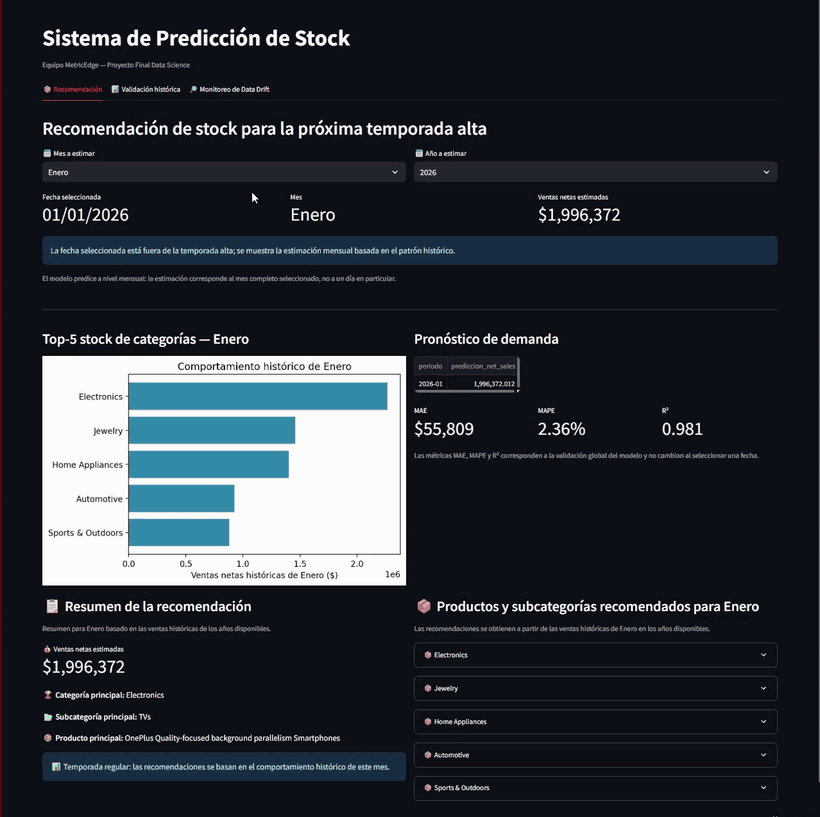

<p align="center">
  
</p>

[](https://final-proyect-irfde8x9bkbgmatc3ejyq7.streamlit.app/) [](#)

Sistema que predice cuánto stock se va a necesitar por categoría de producto a lo largo del año — incluyendo los picos de alta demanda — entrenado y validado sobre datos reales de ventas. Proyecto de referencia académico para la academia **Henry**.

## 🚀 Demo en vivo

**👉 [Abrir la demo en Streamlit](https://final-proyect-irfde8x9bkbgmatc3ejyq7.streamlit.app/)**

Sin instalar nada: elegí cualquier mes y mirá la predicción de stock por categoría, el pronóstico de demanda, la validación histórica del modelo y el monitoreo de *data drift*.

<p align="center">
  
</p>

<p align="center"><sub>Recomendación de stock por mes · validación histórica del modelo · alerta de <em>data drift</em> al detectar un cambio en los datos</sub></p>

## 📖 ¿Qué es esto?

El objetivo original del proyecto era un recomendador de productos personalizado, por cliente. El análisis exploratorio mostró que ese dataset **no tiene señal individual explotable** — confirmado comparando tres modelos predictivos distintos bajo el mismo rigor metodológico. En vez de forzar una solución débil, el equipo redirigió el esfuerzo hacia el problema donde los datos sí mostraban un patrón fuerte: la **predicción de stock por categoría a lo largo de todo el año**, incluyendo — pero sin limitarse a — los meses de alta demanda.

## 🧪 Resultado principal

Comparación de los 3 modelos candidatos evaluados (split temporal 80/20, sin fuga de datos), con Precision como métrica común:

| Modelo | Pregunta que responde | Precision | ¿Señal real? |
|---|---|---|---|
| Predicción de retrasos en la entrega | ¿Este pedido va a llegar tarde? | 14.7% | No |
| Predicción de devoluciones | ¿Este pedido va a ser devuelto? | 9.0% | Muy débil |
| **Predicción de Stock** | ¿Cuánto stock necesito por categoría el próximo mes? | **Precision@5: 100%** | **Sí — fuerte y estable** |

El modelo de Predicción de Stock no es un clasificador (no tiene ROC-AUC) — es un ranking + pronóstico, por eso se mide con Precision@K. Además pronostica la demanda mensual con **2.36% de error (MAPE)** y acierta el Top-5 de categorías en **4 de 4 años** de backtesting, todo el año, no solo en temporada alta. Metodología completa, tablas de cada modelo y análisis de por qué los otros dos no alcanzan, en el informe técnico.

## 📚 Informe técnico

Este README es una guía rápida. Para el análisis completo — calidad de datos, EDA de negocio, diseño y comparación de los 3 modelos, y el pipeline del modelo elegido —:

**👉 [Consultar el Informe Técnico completo](reports/README.md)**

## 🎤 Presentación

**👉 [Ver la presentación completa (Demo Final)](presentation/Demo_Final.pptx)**

## 🛠️ Tecnologías utilizadas

`pandas` / `numpy` (procesamiento) · `scikit-learn` / `LightGBM` (modelado) · `statsmodels` (pronóstico) · `MLflow` (tracking de experimentos) · `Streamlit` (demo funcional) · `Power BI` (dashboard de negocio) · `Jupyter` (análisis)

## 📊 Dataset

[E-commerce Sales & Customer Analytics (150k)](https://www.kaggle.com/datasets/datascikhan/e-commerce-sales-and-customer-analytics) (Kaggle): 4 tablas — clientes, catálogo de productos, líneas de orden y ventas — con datos simulados de e-commerce (2021-2025).

## 📁 Estructura del repositorio

```
Final-Proyect/
├── assets/
│   └── banner.png                                     # Banner de este README
├── data/
│   ├── raw/                                           # CSV originales de Kaggle
│   └── processed/                                      # Generado por src/etl.py
├── notebooks/
│   ├── 01_eda_primario.ipynb                          # Diagnóstico de calidad de datos
│   ├── 02_eda_profundo.ipynb                          # Viabilidad de negocio
│   ├── 03_propuesta_prediccion_stock.ipynb            # Modelo elegido — desarrollo completo
│   ├── 04_evaluacion_metricas_estacional.ipynb        # Comparación de los 3 modelos
│   └── 05_modelo_pronostico_demanda.ipynb             # Detalle del componente de pronóstico
├── src/
│   ├── etl.py                                         # Pipeline de limpieza de datos
│   ├── ft_engineering_model_recomendacion_estacional.py
│   ├── train_model_recomendacion_estacional.py        # Backtesting, ranking, pronóstico
│   ├── cargar_modelo.py                                # Carga el artefacto entrenado
│   ├── drift_utils.py                                  # Monitoreo de drift (PSI, KS, JS, Chi²)
│   └── models/
│       └── seasonal_recommendation_model.joblib
├── dashboard/
│   └── e_commerce_dashboard.pbix                       # Dashboard de negocio (Power BI)
├── presentation/
│   └── Demo_Final.pptx                                 # Presentación completa (Demo Final)
├── reports/
│   └── README.md                                       # Informe técnico completo
├── docs/                                               # Documentación extendida por etapa
├── app.py                                              # Demo funcional (Streamlit)
├── requirements.txt                                    # Dependencias mínimas para la demo
├── requirements_dev.txt                                # + notebooks, entrenamiento, MLflow
└── README.md
```

## ⚙️ Instalación

```bash
git clone https://github.com/SaraHenaoB/Final-Proyect
cd Final-Proyect
pip install -r requirements.txt
```

## ▶️ Reproducir el proyecto

### 1. Correr la demo directamente (recomendado)

El repositorio incluye el modelo ya entrenado (`src/models/seasonal_recommendation_model.joblib`), así que la demo funciona sin reentrenar nada:

```bash
streamlit run app.py
```

### 2. Reentrenar el pipeline completo

```bash
pip install -r requirements_dev.txt
python src/etl.py
python src/train_model_recomendacion_estacional.py
```

### 3. Explorar los notebooks

```bash
jupyter notebook notebooks/01_eda_primario.ipynb
```

Numerados y secuenciales — el detalle narrativo de cada uno está en el [informe técnico](reports/README.md).

## 👥 Equipo

| Integrante | Rol | LinkedIn |
|---|---|---|
| Christian Tamayo | Data Scientist | [LinkedIn](https://www.linkedin.com/in/cantamayo21/) |
| Deiberlyn Nin | Data Scientist | [LinkedIn](https://www.linkedin.com/in/deiberlyn-nin-b893b1432/) |
| Sarah Henao | Scrum Master | [LinkedIn](https://www.linkedin.com/in/sarahenao/) |
| Simón Bedoya | Data Scientist | [LinkedIn](https://www.linkedin.com/in/sim%C3%B3n-bedoya-05bb57398/) |
| Verónica Iacono | Data Scientist | [LinkedIn](https://www.linkedin.com/in/veronica-iacono-69b0671a3/) |

## 🔭 Próximas mejoras

- Automatizar el reentrenamiento periódico del modelo a medida que ingresan nuevos datos de venta
- Convertir el monitoreo de drift en un job programado con notificaciones
- Revisitar la predicción de riesgo de devolución si se dispone de features operativas más ricas

## 📬 Contacto

¿Preguntas o sugerencias? Abrí un [issue](https://github.com/SaraHenaoB/Final-Proyect/issues) en este repositorio.
